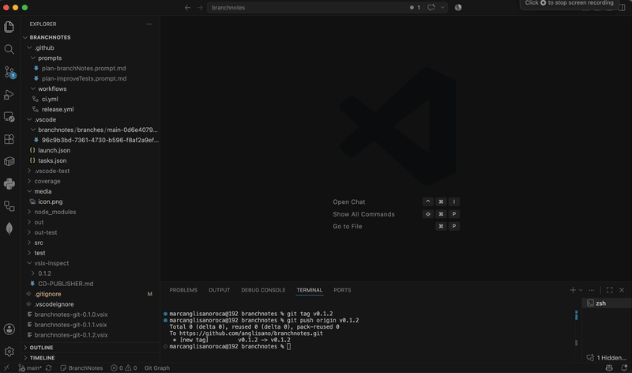

# BranchNotes

BranchNotes is a VS Code extension for keeping local Markdown notes organized by Git repository and branch. Capture the context of a branch without mixing it with notes from another one.

<p align="center">
  
</p>

## Features

- Browse notes grouped by branch from the BranchNotes panel.
- Create and edit regular Markdown files in the VS Code editor.
- Import `TODO`, `FIXME`, `HACK`, and `XXX` items from a repository into a new note.
- Delete notes by sending them to the system trash after confirmation.
- Optionally add `.vscode/branchnotes/` to `.gitignore`.

## Commands

- **BranchNotes: Open Notes Panel**: Open the notes panel grouped by branch.
- **BranchNotes: Create Note**: Enter a title and open a new editable Markdown file.
- **BranchNotes: Create Note from TODOs**: Scan the repository and create a note grouped by file.
- **BranchNotes: Edit Note**: Open the original note in the VS Code editor.
- **BranchNotes: Delete Note**: Confirm and send a note to the system trash.
- **BranchNotes: Add Notes to .gitignore**: Add `.vscode/branchnotes/` to `.gitignore` with explicit confirmation.

## Markdown Notes

Notes open as regular `.md` files in the VS Code editor, so you can use headings, lists, links, code blocks, and checkboxes as usual. Use **Markdown: Open Preview to the Side** to preview a note.

Each note stores its branch metadata in front matter and keeps the Markdown content editable.

## TODO Scanner

Configure markers, excluded directories, and the maximum text length from **Settings → Extensions → BranchNotes** or `settings.json`:

```json
{
	"branchnotes.todoMarkers": ["TODO", "FIXME", "BUG", "REVIEW"],
	"branchnotes.todoExcludeDirectories": [".git", "node_modules", "dist", "vendor"],
	"branchnotes.todoMaxTextLength": 100
}
```

By default, BranchNotes searches for `TODO`, `FIXME`, `HACK`, and `XXX`, while excluding common dependency and generated directories. TODO results include the file, line, and matching text.

## Where Notes Are Stored

Notes are stored locally in the workspace as independent Markdown files:

```text
.vscode/branchnotes/
├─ branches/
│  ├─ main-<hash>/notes/<id>.md
│  └─ feature-login-<hash>/notes/<id>.md
└─ no-git/notes/<id>.md
```

Branch names are converted into safe keys to avoid collisions, while the original branch name is preserved in the note metadata. In a workspace without Git, notes are stored in `no-git`.
